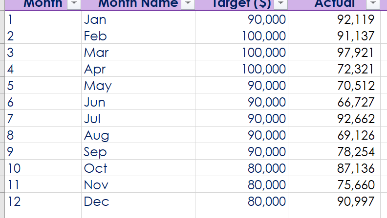
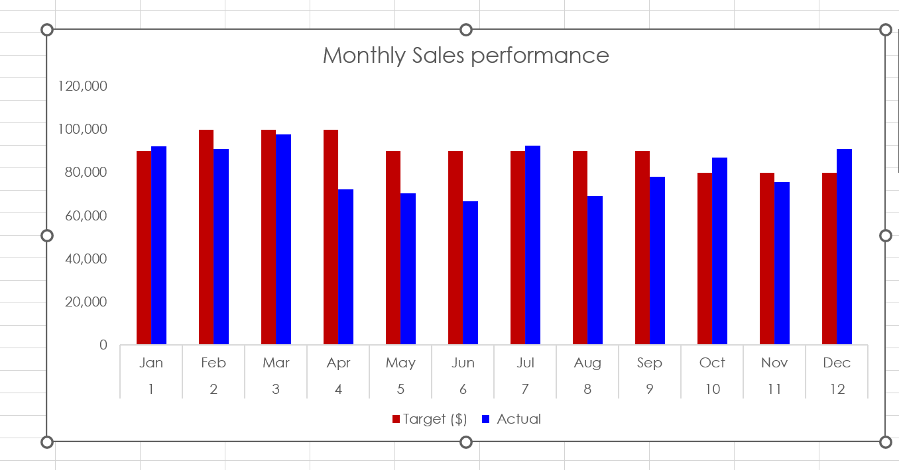

# ClassTrial
This is a class trial for uploading documents.

## Introduction
XYz LTD set a monthly sales target for 2023. I have computed the monthly sales figure from the original data source provided.

## Method of Analysis
I created a field for the calculated sales amount for each month from Jan to Dec. And extracted the monthly sales target from the company's 2023 sales forecast.
:------------------

Monthly Sales Tables

## Display.

A bar chart display of the monthly performance is attached below.
- The red bars depict the sales target while the blue bars represent the actual sales.

